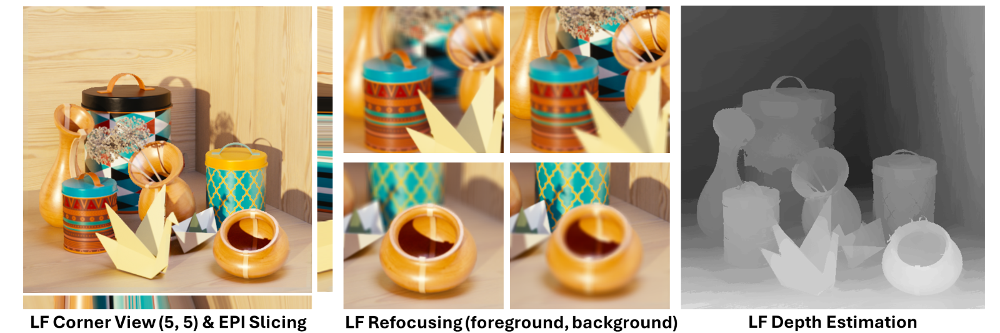

<h1 align="center">Geometrically Consistent Light Field Synthesis using Repaint Video Diffusion Model</h1>

This repository is the official implementation of [Geometrically Consistent Light Field Synthesis using Repaint Video Diffusion Model]() (*Note: The link is still being prepared*)

> **Geometrically Consistent Light Field Synthesis using Repaint Video Diffusion Model** <br>
> Soyoung Yoon, In Kyu Park

<p align="center"></p>

## Installation
### Environment
- 64-bit Python 3.8 and PyTorch 2.2.0 or higher
- CUDA 11.8
```bash
conda env create -f environment.yaml
conda activate RepaintSVD
```

## Pretrained Weights & Data
### Pretrained Weights
You can download the pretrained weights from the following link:
[Link]() (*Note: The link is still being prepared*)
### Data Preparation
To run the inference script, you need to prepare the input data as follows:
- Place your input images in the input folder
- Ensure that each image has a corresponding depth file 
- The depth estimation for the input images was performed using the [MiDaS](https://github.com/isl-org/MiDaS) depth estimation model

```bash
input/
├── image_01.png
├── image_01.npz
└── ...
```

## Inference
### Inference
To generate Light Field images from the pretrained models, run the following command:

```
python inference_LF.py

Options:
    --height                 Height of the output images (<span style="color:gray">default: 512</span>)
    --width                  Width of the output images (<span style="color:gray">default: 512</span>)
    --grid_size              Size of the grid for light field rendering (<span style="color:gray">default: 5</span>)
    --ckpt                   Path to the model checkpoint (<span style="color:gray">default: "./pretrained_weights</span>")
    --input_dir              Input directory containing images and depth data (<span style="color:gray">default: "./input"</span>)
    --image_name             Image name to be processed (<span style="color:gray">default: "hci_1.png"</span>)
    --output_dir             Output directory for results (<span style="color:gray">default: "./result"</span>)
    --offset                 Baseline for light field rendering (<span style="color:gray">default: 0.06</span>)
    --focal_x                Focal length of the camera (<span style="color:gray">default: 0.1</span>)
    --focal_y                Focal length of the camera (<span style="color:gray">default: 0.1</span>)
    --principal_move_x       Principal point move for intrinsic matrix adjustment (<span style="color:gray">default: 2.0</span>)
    --principal_move_y       Principal point move for intrinsic matrix adjustment (<span style="color:gray">default: 2.0</span>)
    --width_ori              Width of the original images for calculating principal point move (<span style="color:gray">default: 512</span>)
    --height_ori             Height of the original images for calculating principal point move (<span style="color:gray">default: 512</span>)
    --erode_radius           Radius for mask erosion (<span style="color:gray">default: 15</span>)
    --decode_chunk_size      Decode chunk size (<span style="color:gray">default: 14</span>)
    --num_inference_steps    Number of inference steps (<span style="color:gray">default: 25</span>)
    --motion_bucket_id       Motion bucket ID (<span style="color:gray">default: 127</span>)
    --noise_aug_strength     Noise augmentation strength (<span style="color:gray">default: 0.07</span>)
    --overlay_end            Overlay end time for Repaint (<span style="color:gray">default: 0.7</span>)

```

### Results